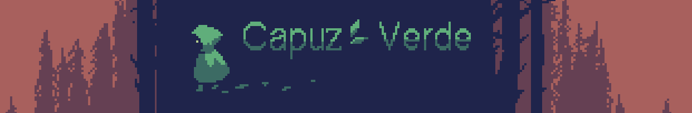

# CapuzVerde

## versão: 0.0.1.12

### Um jogo desenvolvido para o aprendizado meu e de uma equipe.Utilizaremos nesse projeto o motor Godot 3.5.1 standart version com plugin. Os plugins ficam anexados aos projetos então talvez não precise instalar ele. O projeto atual tem apenas um jogo, mas os conhecimentos podem ser reciclados para futuros projetos.

## atualizações

### recente👆​ antigo👇​​
- adicionado sprite de tecla de interação com npc
- inimigo seguindo e particulas do dash reimplementadas
- ataque e dash usando a barra de energia
- dash atualizado, não é mais detectado pelo inimigo
- knockback do player e inimigos implementado
- separação de funções do player e dos inimigos em maquinas de estado
- captura de variaveis nos dialogos feita.
- corrigido problema de transição de mapas ao exportar o jogo.
- dash atualizado, zona de ataque dos inimigos atualizada, bots inimigos seguem e pulam plataforma.
- criação e construção do mapa 3.
- adicionado barra de energia.(que some quando está completa).
- adicionado animação de idle.
- arquivos de mapas estão em pastas agora, para melhor organização, além de .outras correções e organização dos códigos.
- painel de Pause corrigido, pode dali Esc que agora funciona normal fml.
- hub mais elegante e ordenado, agora ele tem contador de comida, que futuramente será utilizado.
- agora tem hub e contador de vida.
- corrigido o dialogo do npn do tutorial.
- corrigido o comportamento da câmera durante a pausa.
- corrigido o retorno do menu de pausa para o menu principal.
- cena de tutorial mais apresentavel, porém apresenta bug no dialogo do personagem do tutorial.
- atualizado o menu "about" na tela inicial.
- alguns códigos tem descrições e notas, isso é util para conduzir os demais colaboradores.
- adicionado modificador de vida(quantidade de vida em 3 e quando efetuado dano sobre o jogador, o mesmo faz animação de salto e pisca vermelho).

## Lista de tarefas

| nivel   | Descrição                                                                                                                                                                                                                                                                |
| ------- | ------------------------------------------------------------------------------------------------------------------------------------------------------------------------------------------------------------------------------------------------------------------------ |
| médio   | Criar spawn de monstros, para o jogo não ficar com quantidade amarrada. Ou deixa assim mesmo, não sei.                                                                                                                                                                   |
| médio   | Criar mecanica de comidas,[ja existe o contator no hub] que a cada 10 comidas(ou outro valor), o valor é resetado a zero e o coração acrescenta 1.                                                                                                                       |
| médio   | Criar boosts pra cada comida que ele ingerir? Ex.:(banana salta mais alto por causa do tripé)                                                                                                                                                                            |
| médio   | Quando o monstro morrer, dropar itens.(se a tarefa de comida de cima tiver feita, o mob poderia dropar elas, para alimentar o player)                                                                                                                                    |
| ✅feito | Captura de variaveis no dialogo: Para que isso? para que as decisões do jogador nos diálogos dos personagens influenciem nas proximas conversas e no jogo. Podemos criar uma variável "respeito" e ela ir aumentando ou diminuindo com o progresso do jogador nos NPCs.. |
| difícil | algum NPC ter o dialogo de levar o jogador a mapa X, o jogador escolhe por viagem rapida, então ele escolhe a opção de dialogo que teleporta ele para aquela região.(pode ter uma animação de viagem, seja por magia ou o jogador viajando de carroça kkkk)              |
| difícil | Criar um inventário, o jogo pode ter sprite de outras armas no futuro, mas não da pra escolher armas e outros equipamentos se não tiver inventário, não é mesmo?                                                                                                         |

## Tarefas para o futuro

| nivel       | Descrição                                                                                                                                                      |
| ----------- | -------------------------------------------------------------------------------------------------------------------------------------------------------------- |
| Não se sabe | Adicionar sons ao jogo, áudio de movimentos, bots, conversas, sons de dialogo, sons de passos, sons de funto(vento e arvores, talvez passaros, fundo de vila). |
| Não se sabe | Criar trilha sonora, requer analise do genero do jogo e se é cabível criar trilhas elaboradas ou não.                                                          |
| Não se sabe | Sistema de idioma, para o jogo ter alcance maior, é preferivel que ele seja em inglês.                                                                         |
| Não se sabe | Integrar o jogo para ser jogado no joystick.                                                                                                                   |
| Não se sabe | Fazer uma versão mobile? (já tenho conta de Dev lá ps.: benicio) .                                                                                             |

## explicando a versão

0.0.0.1 | Atualização feita nessa ultima faixa da versão, indica correções pequenas de bugs ou implementações a niveis simples, quando algo está em teste e não é oficial mas que ainda sim acrescenta no projeto, e incrementado essa faixa.

0.0.1.0 | Atualização feita nessa penultima faixa da versão, indica que as correções são de maior porte e que podem influenciar em mecanicas gerais, como mapas completos e funções de characters. Quando uma atualização de porte maior for feita, como que pode mudar o funcionamento do jogo, essa faixa da versão é incrementada e o valor da faixa menor é resetado a 0.

0.1.0.0 | Atualização feita nessa segunda faixa da versão, indica que jogo está jogável e que pode ser considerado zerável. já tendo algum inicio, meio e fim. Quando algo envolvendo grandes quantidades de mecânicas, templates, artes e história for alterada, se incrementa essa faixa e o valor das faixas menores é resetado a 0.

1.0.0.0 | Atualização feita nessa primeira faixa da versão, indica que o jogo já está pronto e pode ser publicado, quando o jogo adquiri não só mecanicas, mas mapas inteiros, personagens, histórias e novos assets(como espécie de DLC), aí então essa faixa pode ser incrementada e o valor das faixas menores é resetado a 0.
